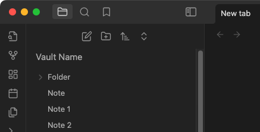
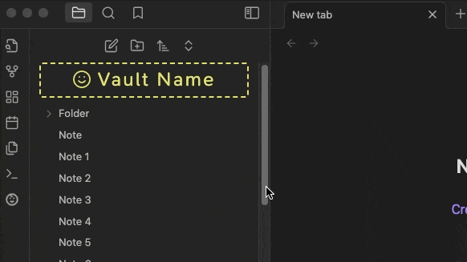
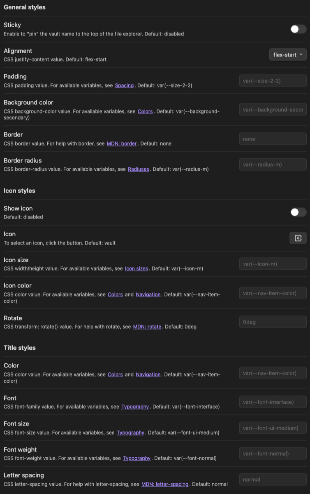

# Vault Name

An Obsidian.md plugin for customizing and displaying the vault name (title) in the side navigation file explorer, similar to pre 1.6.0 versions of Obsidian.

Pairs well with the [Legacy vault switcher](https://github.com/Quorafind/Obsidian-Legacy-Vault-Switcher) plugin.

## Screenshots

**Default styling**

**Customized styling with sticky position**

**Settings tab**

## Installation

### Community plugins

1. [Obsidian.md/plugins](https://obsidian.md/plugins?id=vault-name) or
2. Open *Settings* > *Community Plugins* > *Browse*
3. Search for "vault name"

### via BRAT (Beta Reviewer's Auto-update Tool)

1. Ensure [BRAT](https://github.com/TfTHacker/obsidian42-brat) is installed
2. Trigger the command `Obsidian42 - BRAT: Add a beta plugin for testing`
3. Enter this repository, `gapmiss/obsidian-vault-name`
4. Enable _Vault Name_ plugin in community plugin list

### Manually

1. download `main.js`, `manifest.json` & `styles.css` from the latest [release archive](https://github.com/gapmiss/obsidian-vault-name/releases/)
2. create a new folder `/path/to/vault/.obsidian/plugins/obsidian-vault-name`
3. move all 3 files to `/path/to/vault/.obsidian/plugins/obsidian-vault-name`
4. Settings > Community plugins > reload **Installed plugins**
5. enable _Vault Name_ plugin