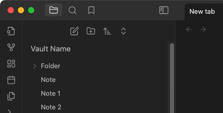
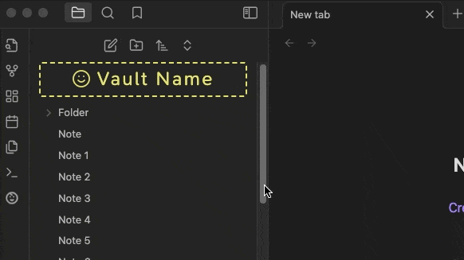
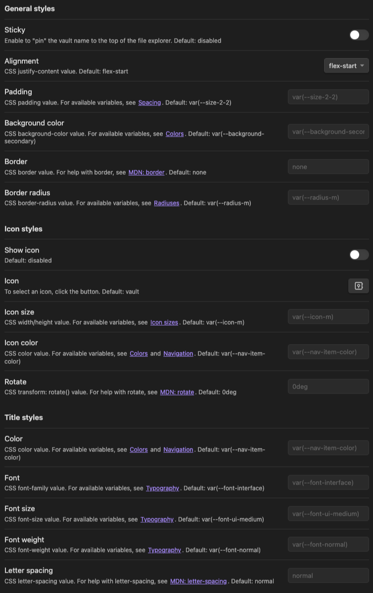

# Vault Name

An Obsidian.md plugin for customizing and displaying the vault name (title) in the side navigation file explorer, similar to pre 1.6.0 versions of Obsidian.

Pairs well with the [Legacy vault switcher](https://github.com/Quorafind/Obsidian-Legacy-Vault-Switcher) plugin.

## Installation

[Install from community.obsidian.md](https://community.obsidian.md/plugins/vault-name)

From Obsidian's settings or preferences:

1. Community Plugins > Browse
2. Search for "Vault Name"

Manually:

1. download the latest [release](https://github.com/gapmiss/obsidian-vault-name/releases/latest) archive
2. uncompress the downloaded archive
3. move the `obsidian-vault-name` folder to `/path/to/vault/.obsidian/plugins/` 
4.  Settings > Community plugins > reload **Installed plugins**
5.  enable plugin

or:

1.  download `main.js`, `manifest.json` & `styles.css` from the latest [release](https://github.com/gapmiss/obsidian-vault-name/releases/latest)
2.  create a new folder `/path/to/vault/.obsidian/plugins/obsidian-vault-name`
3.  move all 3 files to `/path/to/vault/.obsidian/plugins/obsidian-vault-name`
4.  Settings > Community plugins > reload **Installed plugins**
5.  enable plugin

## Screenshots

**Default styling**

**Customized styling with sticky position**

**Settings tab**

